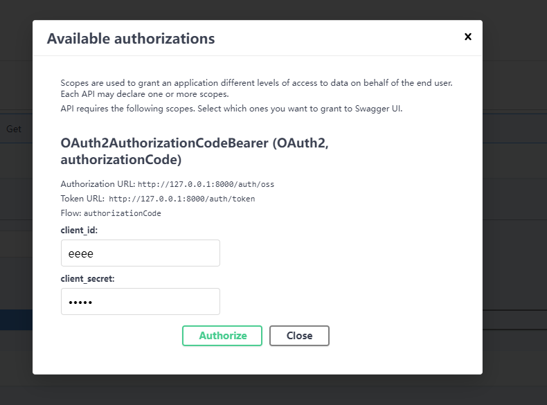

# 2023年9月19日

##  OAuth2 AuthorizationCode 授权码流程解析

| fastapi的openapi文档页面是依靠 /openai.json 数据来生成的。

首先定义的 OAuth2AuthorizationCodeBearer 会被生成到 /openai.json，让openai页面的认证方式显示 OAuth2AuthorizationCodeBearer 认证。

```python
oss = OAuth2AuthorizationCodeBearer(
    authorizationUrl="http://127.0.0.1:8000/auth/oss", 
    tokenUrl="http://127.0.0.1:8000/auth/token",
    refreshUrl="http://127.0.0.1:8000/auth/refresh", # 这个刷新url openapi文档里不知道怎么用
)
```


当我们点击 `Authorize` 按钮的时候，openai页面会打开 `authorizationUrl` 配置的认证页，跳转到外部认证页面。

| XY SSO其实也是基于授权码认证，因此`authorizationUrl`相当于跳转到了 XY SSO 登陆页面。

不过跳转的`authorizationUrl`是添加了一些查询参数的，格式如下：

```shell
authorizationUrl?response_type=code&client_id=eeee&redirect_uri=http%3A%2F%2F127.0.0.1%3A8000%2Fdocs%2Foauth2-redirect&state=VHVlIFNlcCAxOSAyMDIzIDIzOjM4OjIxIEdNVCswODAwICjkuK3lm73moIflh4bml7bpl7Qp
```

response_type 表示返回的认证码类型，这里返回的是授权码。
client_id 表示客户端id，是授权服务器上注册后获得的客户端标志id，用来验证请求是否来自合法的客户端。
redirect_uri 表示回调地址，是客户端的回调地址，用来接收授权码，授权码发放的时候会以名为`code`的参数添加到 `redirect_uri` 的查询参数里。例如：redirect_uri?code=1234
state 表示客户端的随机字符串，用来防止CSRF攻击。 XY SSO就没处理这个参数。

所以当点击 `Authorize` 按钮的时候就打开了 

```shell
http://127.0.0.1:8000/auth/oss?response_type=code&client_id=eeee&redirect_uri=http%3A%2F%2F127.0.0.1%3A8000%2Fdocs%2Foauth2-redirect&state=VHVlIFNlcCAxOSAyMDIzIDIzOjM4OjIxIEdNVCswODAwICjkuK3lm73moIflh4bml7bpl7Qp
```

这个地址就是授权登录页面地址，例如 XY SSO的登录页面。
当用户输入用户名和密码，点击登录按钮的时候，就会调用到 `redirect_uri` 配置的回调地址将 `code` 附加到回调地址的查询参数里。

openapi的授权码认证流程种固定会回调到：

```shell
http://127.0.0.1:8000/docs/oauth2-redirect?code=12345&state=xxxxxxx
```
`oauth2-redirect` 这个页面是由`fastapi.openai.docs:get_swagger_ui_oauth2_redirect_html` 生成的。

这个页面是个代理页面，在这个页面他会调用 `tokenUrl`  获取token和刷新token。然后关闭这个页面。

我不是很能理解为什么这个页面获取到 `access token` 后能够影响到 `openapi` 页面，让`openai` 页面也能获取到 `access token`。而且翻遍了 `openapi`页面， `localstorage` `sessionstorage` `cookies` 没有找到有保存 `access token`。然后在openapi页面请求测试接口的时候，他又能够在请求头里加上 `Authorization：Bearer access token` 头。而且这个 `token` 正好是前面中间页面获得的那个。

## 如何将XY SSO 接入并兼容 前面的授权码配置

其实 XY SSO的一个问题是 `XYSSO_TOKEN_ENPOINT` 返回的内容并不是 `access token` 而是 `userinfo` 用户信息。

因此我们需要实现自己的 `token enpoint` 来桥接转换掉 `XYSSO_TOKEN_ENPOINT`。

最终配置如下：

```python
oss = OAuth2AuthorizationCodeBearer(
    authorizationUrl=XYSSO_AUTHORIZATION,
    tokenUrl="http://127.0.0.1:8000/auth/token", # 
    refreshUrl="http://127.0.0.1:8000/auth/refresh", 
)


class OAuth2AuthorizationCodeForm:
    def __init__(
        self,
        *,
        grant_type: Annotated[str, Form()],
        code: Annotated[str, Form()],
        client_id: Annotated[str, Form()],
        client_secret: Annotated[str, Form()],
        redirect_uri: Annotated[str, Form()],
    ) -> None:
        self.grant_type = grant_type
        self.code = code
        self.client_id = client_id
        self.client_secret = client_secret
        self.redirect_uri = redirect_uri


@api.post("/token", include_in_schema=False) # 这个接口因该隐藏
async def token(
    request: Request,
    form: OAuth2AuthorizationCodeForm = Depends(OAuth2AuthorizationCodeForm),
):
    # TODO: 利用 form 的数据去简介请求 XYSSO_TOKEN_ENPOINT 获取用户信息 ssoinfo。
    # ssoinfo种包含了用户基本信息，但是不包含token。
    # [ ]: 如果用户在数据库中不存在就创建。
    # [ ]: 生成 access_token 和 refresh_token，一定要按照 {"access_token":xxx,"refresh_token":xxx}
    # 的结构返回openapi才能够识别。

    return dict(access_token="access token yhee", refresh_token="refresh me")

@api.post("/refresh")
async def refresh_token(refresh_token:...):
    # TODO: 校验refresh_token
    # 用refersh_token的信息重新创建token返回
    return dict(access_token="new access token", refresh_token="refresh me")

```

上面的代码只是让 sso 能够兼容到 openapi 里，但是 vue前端 要接入上面的sso还是很麻烦。

主要有以下问题：

1. openapi的认证工具会自动根据 OAuth2AuthorizationCodeBearer 的信息拼接出 sso 页面链接。这意味着 vue前端也得自己读取后端配置去拼接生成sso页面链接。
2. sso登录页成功后，应该回调到vue前端的某个地址，比如/login。openapi就是回调到 `oauth2-redirect`，然后在`oauth2-redirect`中请求`access token`。vue前端也应该这样。

目标：
1. vue前端只管找后端要sso登录链接，sso的配置不配置在前端。
2. vue前端找后端要sso登陆链接的时候附上自己的回调url。
3. vue通过回调拿到 code 授权码后再用授权码请求 `access_token`和`refresh_token`。

```python

@api.get("/sso")
async def get_sso(redirect_uri:str):
    # 拼接sso url 返回

    sso_url = f"{XYSSO_AUTHORIZATION_ENDPOINT}?client_id={CLIENT_ID}&response_type=code&redirect_uri={redirect_uri}"

    return sso_uri

@api.get("/token")
async def token(code:str):
    # 请求access_token和refresh_token
    return dict(access_token="access token yhee", refresh_token="refresh me")

...

```

所以就有两套了。