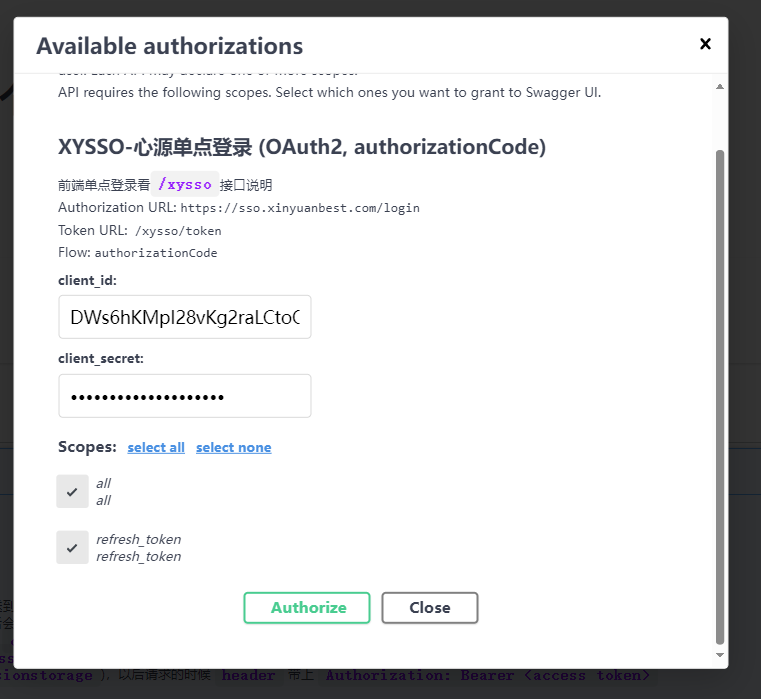

# 2023年9月20日

## XYSSO接入FastAPI/OpenAPI OAuth2AuthorizationCodeBearer总结

之前提到过`XYSSO`本质上是`OAuth2`的授权码登录。那么按道理应该可以使用`OAuth2AuthorizationCodeBearer`来接入。
同时也能够兼容`OpenAPI`的认证工具。

实际实践下来，初步成功的实现了`XYSSO`的`OAuth2AuthorizationCodeBearer`。但是还有一些瑕疵。

### 瑕疵1：
`OpenAPI/Swagger`的认证工具对授权码认证的支持还不足。虽然`OAuth2AuthorizationCodeBearer`有`refreshUrl`这个参数，这个参数
是用来配置`令牌刷新接口`供`OpenAPI/Swagger`在令牌失效的时候或快失效的时候来刷新令牌的。但是`OpenAPI/Swagger`的认证工具目前还不支持`refreshUrl`。

相关ISSUE：
[Automatic token refresh for REST API with OpenID Connect authentication?](https://github.com/swagger-api/swagger-ui/issues/7257)

也就是说我们在 `OpenAPI/Swagger` 中无法做到自动刷新令牌，只能在`.env`中在开发模式下将`JWT_EXPIRE_MINUTES`的过期时间设置的更长一点。

### 瑕疵2：

`XYSSO` 的接口设计问题。

`XYSSO_AUTHORIZATION_ENPOINT` 是授权码获取接口。

一个规范的授权码 `URL` 如下：

```shell
https://sso.xinyuanbest.com/login?
response_type=code&
client_id=DWs6hKMpI28vKg2raLCtoOItNGxoXYeR8Jno47X5&redirect_uri=http%3A%2F%2F127.0.0.1%3A8000%2Fdocs%2Foauth2-redirect&
scope=all%20refresh_token&
state=V2VkIFNlcCAyMCAyMDIzIDE4OjUxOjI0IEdNVCswODAwICjkuK3lm73moIflh4bml7bpl7Qp
```


`client_id` `scope` 对应了 `openapi` 的表单。
`state` 是用来防CORS攻击的。

但是 `XYSSO_AUTHORIZATION_ENPOINT` 重定向的时候只传递了 `code` `xycode` 授权码，但是没有传递 `client_id` `scope` `state`。尤其是 `scope`，导致生成`token`的时候无法这是 `scope`，只能写死 `scope`或者完全不使用`scope`。

`XYSSO`对接`Oauth2AuthorizationCodeBearer`这块`Scope``refreshUrl` 这两部分是无法使用的。


## 现在面临一个问题

如果同时支持 `Oauth2PasswordBearer` 和 `Oauth2AuthorizationCodeBearer`，要怎么实现？

FastAPI貌似不支持同时支持两种认证方式。

要纯用 `依赖项` 来解决认证吗？

