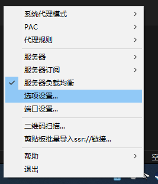
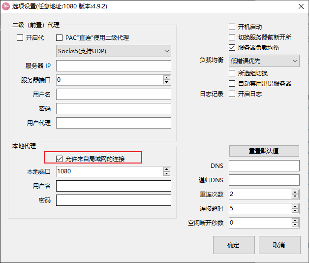
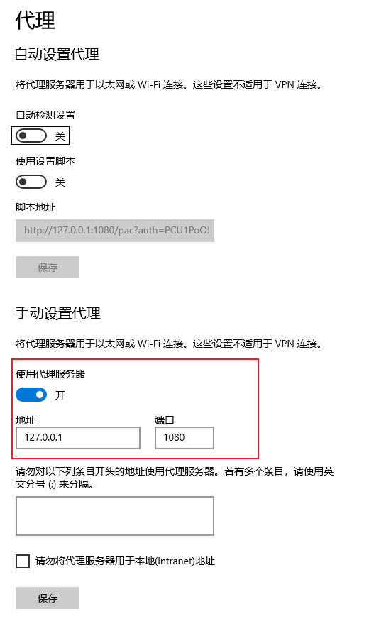
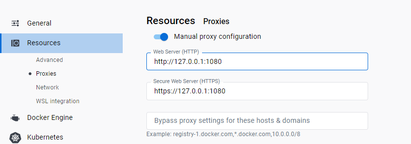
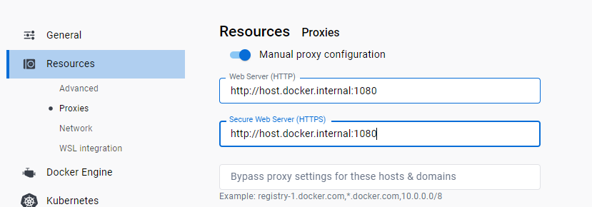

# 2023年9月26日

## Docker中访问github等外网问题

Docker访问外网分为三种情况：
1. Docker Desktop工具本身访问 DockerHub 拉镜像 （Docker工具时）
2. 镜像构建过程中，容器内访问国外网站。(镜像构建时)
3. 从镜像运行创建成容器后，以后从容器中访问github等国外网站。（容器运行时）


## Docker Desktop 本身如何通过代理访问DockerHub

首先由于 Docker for Windows 现在已经是 WSL2 的方案了。docker deamon实际上是运行在了一个轻量级的Hyper-V Linux虚拟机上。因此，Docker for Windows的代理配置，就不能够填写 127.0.0.1:1080 了，因为docker deamon是运行在虚拟机里面的，而宿主机的代理配置。

Docker for Windows为了解决这个问题，在HOSTS文件里加了规则：
```
# Added by Docker Desktop
10.20.169.23 host.docker.internal
10.20.169.23 gateway.docker.internal
# To allow the same kube context to work on the host and the container:
127.0.0.1 kubernetes.docker.internal
# End of section
```

Docker deamon在虚拟机中通过 `host.docker.internal` 来访问宿主主机。
因此Docker Desktop，要使用 `ssr` 这种梯子代理的话，步骤如下：

首先运行`ssr`，然后打开选项设置


设置允许来自局域网的连接

设置代理


在Docker Desktop 设置/Resources/Proxies里如下设置





## 镜像构建（Dockerfile）中使用代理

当我们用Dockerfile去构建镜像时，不可避免地需要在容器里面访问github等受限网络。虽然宿主主机挂了梯子，但是容器内的网络请求是不会经过宿主梯子的。

```dockerfile
FROM alpine:latest

# 代理：如果镜像访问不了github那就需要在宿主主机上设置代理
# 例如，ssr可以设置 127.0.0.1:1080 作为http代理，那么容器内就
# 如下设置环境变量就可以通过宿主的代理访问外网了。如果不需要代理都可以
# 访问就注释掉下面。
ENV http_proxy=http://host.docker.internal:1080
ENV https_proxy=http://host.docker.internal:1080

...

```
通过上面配置生成的镜像默认式通过宿主主机1080端口代理访问外网。当你运行镜像创建容器后，容器内也是用宿主主机1080端口做代理。

## 容器内使用代理

如果镜像创建时本身没有使用代理，而我们需要在容器中使用代理，那么就要在容器里执行下面命令：

```shell
export http_proxy=http://host.docker.internal:1080
export https_proxy=http://host.docker.internal:1080
```

但是这个容器重启后这个代理就失效了。

还有就是通过配置 `~/.docker/config.json`

```json
{
	"auths": {},
	"credsStore": "desktop",
	"proxies": { // 每当容器启动的时候会自动将下面代理设置到容器的环境变量
		"default": {
			"httpProxy": "http://host.docker.internal:1080",
			"httpsProxy": "http://host.docker.internal:1080"
		}
	},
}
```


## DevContainer的坑

自己设计的Dockerfile貌似都无法作为devcontainer使用。devcontainr的镜像必须以`mcr.microsoft.com` 的镜像为基础。


## 总结

上面的问题都存在一个缺点，代理是配置在镜像或者容器里，而不是自动的跟随宿主主机代理。这导致了，如果宿主主机没有开代理，或者代理端口不一致，那么镜像就不仅仅不能访问外网，甚至所有网络都访问不了。

因此，可以尝试分阶段构建镜像，然后将成果镜像作为基础镜像，这样就可以解决上面的问题。最终镜像是没有代理的，但是用户可以自己以后设置代理。