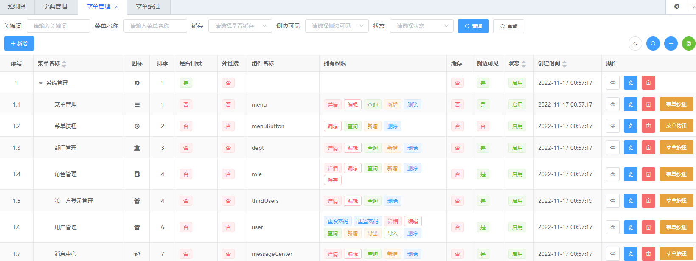
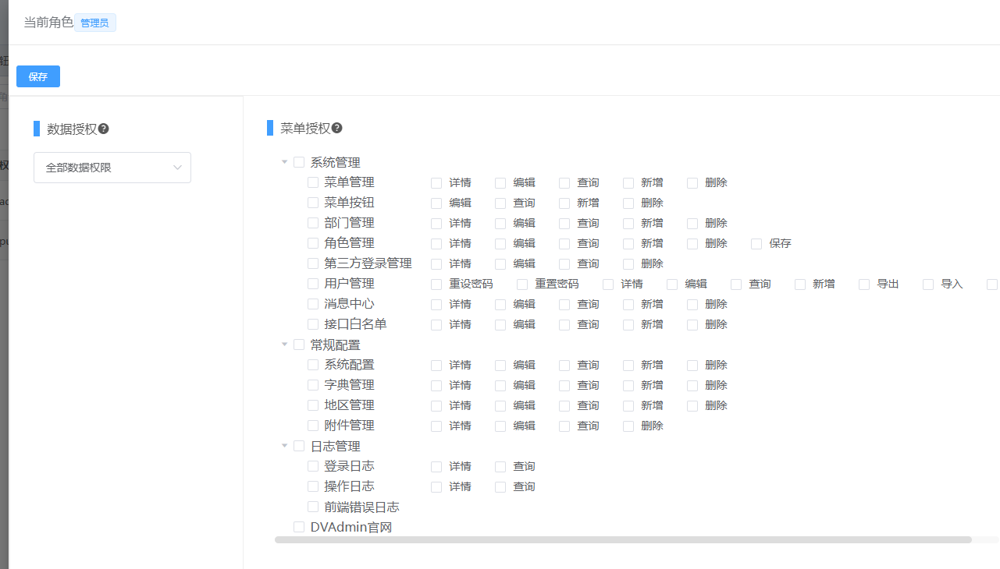

# 2023年9月28日

## 进度总结

1. 后端项目框架初步搭建完毕
2. devcontainer配置完毕，已经可以用统一的开发环境开发了

## 组织、项目、企业微信组织架构问题
组织、项目、企业微信组织架构没有任何手段同步，因此只能像redmine那样：

1. 用户注册或者sso登录系统
2. 由管理员手动创建组织、项目，将用户添加到这些组里

因此组织、项目只需要设计好模块增删改查就可以了。

## 下一步计划

1. 后端基于角色的权限系统？ CASBIN？
2. 前端框架开始？登录页面？


## 初试casbin

`casbin` 是什么？

`casbin` 是国人开发的配置型访问控制库，他将访问控制抽象成了两个配置文件，然后提供一个引擎来读取这些配置去检查获取访问权限。

初看 `casbin` 会觉得它太过灵活，因为 `casbin` 可以通过灵活的配置实现各种常见的访问控制模型的鉴权，比如：ACL、RBAC、ABAC等等。

但是仔细一看其实 `casbin` 的核心其实还是 `model.conf` 和 `policy.csv` 这两个配置。

model.conf - 定义了规则模型
policy - 定义了具体规则

前面各种访问控制模型其实都是通过配置就能够还原。
所以看透本质后，其复杂度反而没有想象中那么高，十分的简练。

### 那么 `casbin` 有没有什么缺点？

#### `policy` 配置在面对RBAC模式的时候难以编辑

一个比较蛋疼的问题是 `policy.csv` 配置编辑问题。 `casbin` 其实不关心 `policy` 配置从哪里获取，我们可以自己实现 `adapter(provider)` 来将 `policy` 的获取改成从数据库里读取或者别的地方读取。

所以 `policy` 规则配置有一个难搞的点是，当用`casbin` 模拟 RBAC 的时候。 角色定义、用户拥有什么角色、角色拥有什么规则全都是定义在一个 `policy` 里。而且 `policy` 配置是个一维的配置。而 RBAC 规则却是个多维映射规则，这意味着以下情况：

一个用户可以拥有N个角色，一个角色可以拥有N个权限。

```csv
# 规则定义
p, admin, user, read
p, admin, user, write
p, admin, user, delete

p, guest, user, read <- 定义 guest角色

# 用户定义
g, alice, admin <- alice是 admin角色
g, tom, guest <- tom 是 guest 角色
```

数据库里就像下面这样：

| id  | ptype | v0    | v1     | v2  | v3  | v4  | v5  |
| --- | ----- | ----- | ------ | --- | --- | --- | --- |
| p   | admin | user  | read   |
| p   | admin | user  | write  |
| p   | admin | user  | delete |
| p   | guest | user  | read   |
| g   | alice | admin |
| g   | tom   | guest |

这样导致了数据库中的 `policy` 表成了天书一样的东西。以后要去维护编辑规则就会十分的麻烦。因为它们存在引用关系，但是表里确实二维平铺的。

#### `casbin` 可能十分难与国人常见的 `RBAC` 做法兼容。

首先网上github各种国人开发的开源管理后台系统，他们都是采用`RBAC`访问控制。但是他们的`RBAC`实现我都不知道是不是同一家培训班出来的，几乎可以说是一模一样。

特点就是：

1. 基于角色，用户拥有角色，角色拥有权限。
2. 基于菜单（页面）和其页面内的按钮的权限控制。

因此其数据库中的RBAC存储模型是：

1. Menu —— 菜单（页面），拥有 MenuButton(Permission)
2. MenuButton —— 菜单按钮（页面中可以操作会发送请求的按钮）—— 就是Permission。
3. Role —— 角色拥有 MenuButton(Permission)

模拟一下大概的配置方式：

Menu表
| id  | name     | url   |
| --- | -------- | ----- |
| 1   | 菜单管理 | /menu |

Permission表
| id  | menu_id | name | type   |
| --- | ------- | ---- | ------ |
| 1   | 1       | 新增 | Create |

Role表
| id  | name  |
| --- | ----- |
| 1   | admin |

Role-Psermission表
| role_id | permission_id |
| ------- | ------------- |
| 1       | 1             |

Role和Permission是多对多关系，Menu包含Permission。

于是乎这些后台管理项目的 RBAC 都长下面的样子：




[如何将传统RBAC数据表结构适配给casbin](https://blog.csdn.net/peihexian/article/details/92798040)

`casbin` 的 `policy` 表直接扔进数据库里完全没法编辑。而传统RBAC结构要喂给 `casbin` 需要转成
`policy` 的格式。因此官方提供了 `adapter` 给我们让我们去转换。